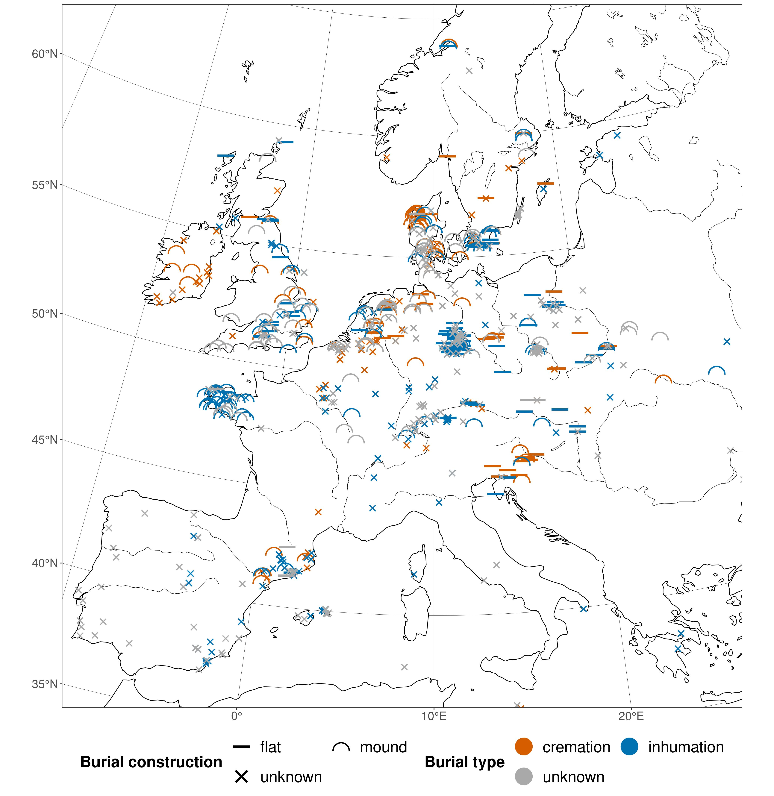

```{r, echo = FALSE}
# https://stackoverflow.com/questions/25646333/code-chunk-font-size-in-rmarkdown-with-knitr-and-latex
def.chunk.hook  <- knitr::knit_hooks$get("chunk")
knitr::knit_hooks$set(chunk = function(x, options) {
  x <- def.chunk.hook(x, options)
  ifelse(options$size != "normalsize", paste0("\\", options$size,"\n\n", x, "\n\n \\normalsize"), x)
})
knitr::opts_chunk$set(echo = TRUE, cache = TRUE)
```

## TOC

\textblockcolour{mDarkTeal}

\huge

- Introduction (Data)

- Simulation (Theory and Method)

- Behavioural Distance

- Behavioural and Spatial Distance


# Introduction

## Data

{ height=85% }

## Research Area and Regions

{ height=85% }

\begin{textblock*}{65pt}(40pt,160pt)
  \setlength\fboxrule{2pt}%
  \noindent\fbox{%
    \begin{minipage}{\linewidth - 2\fboxsep - 2\fboxrule}%
      \raggedright\footnotesize\color{white}
      heterogeneous information density in space and time
    \end{minipage}}%
\end{textblock*}

## Development

\begin{columns}
  \begin{column}{0.48\textwidth}
    \begin{figure}
      \includegraphics{figures/development_amount_regions_burial_type.jpeg}
      \caption{\textbf{Burial type} development absolute numbers}
    \end{figure}
  \end{column}
  \begin{column}{0.48\textwidth}
    \begin{figure}
      \includegraphics{figures/development_amount_regions_burial_construction.jpeg}
      \caption{\textbf{Burial construction} development absolute numbers}
    \end{figure}
  \end{column}
\end{columns}

## Development

\begin{columns}
  \begin{column}{0.48\textwidth}
    \begin{figure}
      \includegraphics{figures/development_proportions_regions_burial_type.jpeg}
      \caption{\textbf{Burial type} development proportions}
    \end{figure}
  \end{column}
  \begin{column}{0.48\textwidth}
    \begin{figure}
      \includegraphics{figures/development_proportions_regions_burial_construction.jpeg}
      \caption{\textbf{Burial construction} development proportions}
    \end{figure}
  \end{column}
\end{columns}


# Simulation

## Concept

- Funeral rituals are **behaviour/ideas/cultural traits** and spread in space and time. They life in **social space** and their spread depends on social relationships.

- Funeral rituals are a special category of ideas: They have a relatively low interaction with the human-environment system and can be treated as **selectively neutral**.

- The main mechanisms of diffusion of neutral variants are **innovation**, **drift** and **flow**.

**Drift:** Dominanz of individual traits due to stochastic processes

**Flow:** Information transfer and synchronization across group boundaries

\noindent\rule{\textwidth}{1pt}

Concept: Ideas are **entities** that expand competitively in a **population graph**. 

## Population Graph

{ height=85% }

\begin{textblock*}{100pt}(50pt,50pt)
  \setlength\fboxrule{2pt}%
  \noindent\fbox{%
    \begin{minipage}{\linewidth - 2\fboxsep - 2\fboxrule}%
      \footnotesize\raggedright\color{white}
      every individuals position in social space and time is defined by their connections
    \end{minipage}}%
\end{textblock*}

\begin{textblock*}{100pt}(250pt,200pt)
  \setlength\fboxrule{2pt}%
  \noindent\fbox{%
    \begin{minipage}{\linewidth - 2\fboxsep - 2\fboxrule}%
      \footnotesize\raggedright\color{white}
      groups have a high degree of internal and a low degree of external interaction
    \end{minipage}}%
\end{textblock*}

## Generic Results

## Generic Results

# Behavioural Distance

## Squared Euclidian Distance (SED)

The Squared Euclidian Distance is a a simple **measure of between-group similarity**.

$$d_{ij}^2 = \sum_{k = 1}^{n} (p_{ik} - p_{jk})^2$$

- $d_{ij}^2$: Squared Euclidean distance between two groups $i$ and $j$
- $k$: Variant counter
- $n$: Total amount of variants in a population
- $p_{ik}$: Relative frequency of the $k$'th variant in population $i$
- $p_{jk}$: Relative frequency of the $k$'th variant in population $j$

## Region Distance Matrix

{ height=85% }

\begin{textblock*}{55pt}(10pt,40pt)
  \setlength\fboxrule{2pt}%
  \noindent\fbox{%
    \begin{minipage}{\linewidth - 2\fboxsep - 2\fboxrule}%
      \raggedright\footnotesize\color{white}
      low distance at the start and end due to universal shift from inhumation to cremation
    \end{minipage}}%
\end{textblock*}

\begin{textblock*}{55pt}(300pt,100pt)
  \setlength\fboxrule{2pt}%
  \noindent\fbox{%
    \begin{minipage}{\linewidth - 2\fboxsep - 2\fboxrule}%
      \raggedright\footnotesize\color{white}
      the gradual change from one tradition to the other in England and Southern Scandinavia evens out the distances
    \end{minipage}}%
\end{textblock*}

\begin{textblock*}{55pt}(10pt,180pt)
  \setlength\fboxrule{2pt}%
  \noindent\fbox{%
    \begin{minipage}{\linewidth - 2\fboxsep - 2\fboxrule}%
      \raggedright\footnotesize\color{white}
      the different adoption rates are visible as peaks of cultural distance
    \end{minipage}}%
\end{textblock*}

## Region Distance Matrix

{ height=85% }

\begin{textblock*}{55pt}(10pt,130pt)
  \setlength\fboxrule{2pt}%
  \noindent\fbox{%
    \begin{minipage}{\linewidth - 2\fboxsep - 2\fboxrule}%
      \raggedright\footnotesize\color{white}
      Central European Cluster?
    \end{minipage}}%
\end{textblock*}

## Region Distance Matrix

{ height=85% }

\begin{textblock*}{55pt}(300pt,200pt)
  \setlength\fboxrule{2pt}%
  \noindent\fbox{%
    \begin{minipage}{\linewidth - 2\fboxsep - 2\fboxrule}%
      \raggedright\footnotesize\color{white}
      Northwestern European Cluster?
    \end{minipage}}%
\end{textblock*}

## Parallel Developments

\begin{columns}
  \begin{column}{0.48\textwidth}
    \begin{figure}
      \includegraphics{figures/regions_squared_euclidian_distance_burial_type.jpeg}
      \caption{Development of \textbf{burial type} SED for each region}
    \end{figure}
  \end{column}
  \begin{column}{0.48\textwidth}
    \begin{figure}
      \includegraphics{figures/regions_squared_euclidian_distance_burial_construction.jpeg}
      \caption{Development of \textbf{burial construction} SED for each region}
    \end{figure}
  \end{column}
\end{columns}

## Correlation

\begin{adjustwidth}{-3em}{-3em}
  \begin{figure}
    \includegraphics{figures/squared_euclidian_distance_burial_type_vs_burial_construction.jpeg}
    \caption{Correlation of \textbf{burial type} and \textbf{burial construction} Mean SED over time}
  \end{figure}
\end{adjustwidth}

\begin{textblock*}{60pt}(290pt,130pt)
  \setlength\fboxrule{2pt}%
  \noindent\fbox{%
    \begin{minipage}{\linewidth - 2\fboxsep - 2\fboxrule}%
      \raggedright\footnotesize\color{white}
      the distances of burial type and construction are not well correlated -- except in the late Early Bronze Age
    \end{minipage}}%
\end{textblock*}


# Behavioural and Spatial Distance

## Spatial Distance Classes

{ height=85% }

## Correlation

\begin{adjustwidth}{-3em}{-3em}
  \begin{figure}
    \includegraphics{figures/squared_euclidian_distance_vs_spatial_distance_burial_type.jpeg}
    \caption{\textbf{Burial type} correlation of Mean SED and spatial distance}
  \end{figure}
\end{adjustwidth}

\begin{textblock*}{60pt}(290pt,130pt)
  \setlength\fboxrule{2pt}%
  \noindent\fbox{%
    \begin{minipage}{\linewidth - 2\fboxsep - 2\fboxrule}%
      \raggedright\footnotesize\color{white}
      spatial distance is only relevant \textbf{before} the widespread transformation starts
    \end{minipage}}%
\end{textblock*}

## Correlation

\begin{adjustwidth}{-3em}{-3em}
  \begin{figure}
    \includegraphics{figures/squared_euclidian_distance_vs_spatial_distance_burial_construction.jpeg}
    \caption{\textbf{Burial construction} correlation of Mean SED and spatial distance}
  \end{figure}
\end{adjustwidth}

\begin{textblock*}{60pt}(290pt,130pt)
  \setlength\fboxrule{2pt}%
  \noindent\fbox{%
    \begin{minipage}{\linewidth - 2\fboxsep - 2\fboxrule}%
      \raggedright\footnotesize\color{white}
      spatial distance is overall more relevant and again in the Early Bronze Age significant
    \end{minipage}}%
\end{textblock*}

## Correlation

<!-- { height=90% } -->

\begin{textblock*}{60pt}(300pt,30pt)
  \setlength\fboxrule{2pt}%
  \noindent\fbox{%
    \begin{minipage}{\linewidth - 2\fboxsep - 2\fboxrule}%
      \raggedright\footnotesize\color{white}
      Compared to simulation results the expansion of cremation behaves highly atypical if we assume spatial correlation   
    \end{minipage}}%
\end{textblock*}


# Conclusion

## Preliminary Observations and Hypotheses

- The diffusion of the cremation funeral tradition and traditions of flat vs. mound graves can both be explained by **neutral variant drift and flow** on a large scale. Local innovation might not have been necessary.

- Both contexts are mostly **independent**, except for a short period in the late Early Bronze Age.

- Both contexts are to a certain degree correlated to **spatial distance** in the Early Bronze Age, but become **increasingly unpredictable** in the Middle Bronze Age.

- The diffusion of cremation burials in the Middle and Late Bronze Age is **almost negatively correlated** with spatial distance.
